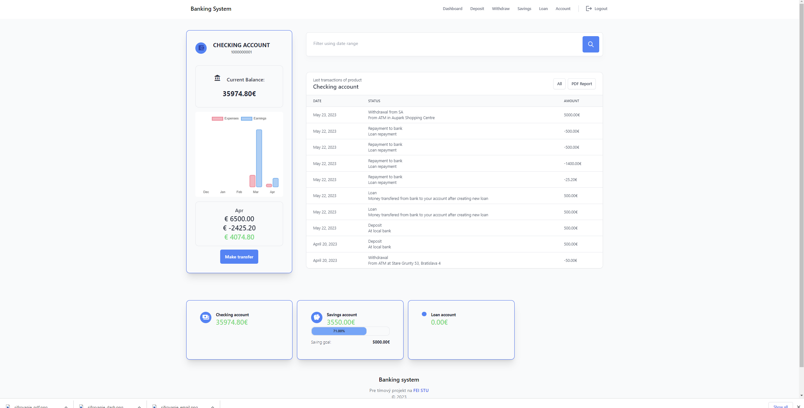
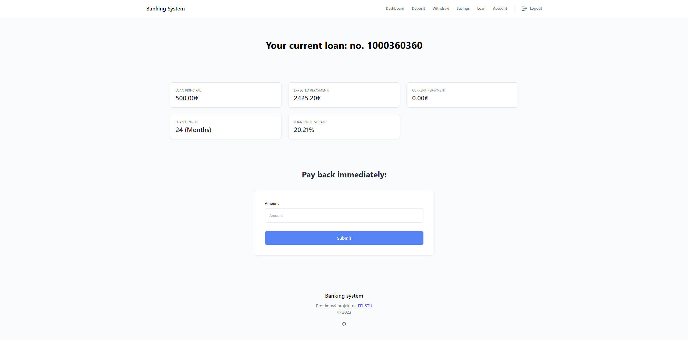

# Online Banking System V2.0.2

This is an Online Banking Concept optimized by the Team Project at FEI STU. The former banking
system was made by saadmk11. The system was created using Django Web Framework.


## Features

* Create Multiple Bank Accounts
* Deposit & Withdraw Money
* Send money internally between users and accounts
* Bank Account Type Support (e.g. Debit Account, Savings Account)
* Interest calculation depending on the Bank Account type
* Take Loans and calculate interest
* Transaction report with a date range filter 
* Account dashboard - including analytics of expenses and earnings
* Monthly transaction reports in encrypted PDF format sent to e-mail
* Two-Factor Authentication
* Calculate Monthly Interest Using Celery Scheduled tasks
* More efficient and accurate interest calculation and balance update
* Ability to add Minimum and Maximum Transaction amount restriction
* UI optimization for mobile and improved UX 


## Prerequisites

Be sure you have the following installed on your development machine:

+ Python >= 3.7
+ Redis Server
+ Git
+ pip
+ Virtualenv (virtualenvwrapper is recommended)

## Requirements

+ celery==4.4.7
+ Django==3.2
+ django-celery-beat==2.0.0
+ pandas==2.0.0
+ python-dateutil==2.8.2+ redis==3.5.3
+ requests==2.28.1
+ reportlab==4.0.0
+ django-ca==1.24.0

## Install Redis Server

[Redis Quick Start](https://redis.io/topics/quickstart)

Run Redis server
```bash
redis-server
```

## Project Installation

Clone GitHub Project,
```bash
git clone https://github.com/siikmusic/banking-system.git

cd banking-system
```

Install development dependencies,
```bash
pip install -r requirements.txt
```

Build Tailwind
```bash
npx tailwindcss -i ./static/src/css/main.css -o ./static/dist/css/main.css --watch
```
Add API credentials file credentials_api.py to the folder ./accounts

If you want to use a PostgreSQL database, you need to edit the /banking_system/settings.py file and update the DATABASES configuration (comment out the SQLite settings and provide the PostgreSQL settings). Additionally, make sure you have a PostgreSQL server running on your computer.
Also you need to install pycopg2,
```bash
pip install psycopg2
```

ALTERNATIVE ->
If you want to use SQLite, you can continue without any further configuration.

Migrate Database,
```bash
python manage.py makemigrations  

python manage.py migrate
```

Load initial data,
```bash
python manage.py loaddata initial_data.json
```

Run the web application locally,
```bash
python manage.py runserver # 127.0.0.1:8000
```

Run Celery
(Different Terminal Window with Virtual Environment Activated)

```bash
pip install gevent

celery -A banking_system worker -l info

celery -A banking_system worker -l info -P gevent

celery -A banking_system beat -l info
```

To create a Superuser (admin), for example : admin@admin.com - xyz123XYZ -> then access admin controls with 127.0.0.1:8000/admin 
- note, only access /admin for admin. Register a normal user at /accounts/register/
```bash
python manage.py createsuperuser
```


## Images:

#

